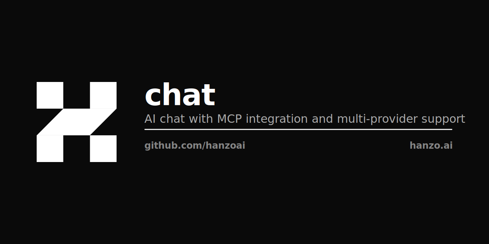

<p align="center"></p>

# Hanzo AI Chat

AI-powered chat platform with enterprise features, using Hanzo's cloud API or local deployment.

## Quick Start

```bash
# Clone and setup
git clone https://github.com/hanzoai/chat.git
cd chat

# Copy environment template
cp .env.example .env

# Edit .env and add your Hanzo API key
# Get your key at: https://hanzo.ai/dashboard
nano .env

# Start the platform
make up
```

Access the chat at http://localhost:3081

## Development

### Basic Development (with hot reload)
```bash
make dev
```

### Full Development (with local router)
```bash
# Set your LLM API keys
export ANTHROPIC_API_KEY=your-key
export OPENAI_API_KEY=your-key

# Start full dev stack
make dev-full
```

## Architecture

```
┌─────────────────────────┐     ┌─────────────────────────┐
│     Hanzo Chat UI       │────▶│   api.hanzo.ai          │
│   (Hanzo Chat)          │     │   (or local router)     │
│    localhost:3081       │     │                         │
└─────────────────────────┘     │  • 100+ AI Models       │
            │                   │  • MCP Tools            │
            │                   │  • Code Execution       │
            ▼                   └─────────────────────────┘
┌─────────────────────────┐
│   Local Data Storage    │
│  • MongoDB (chat history)│
│  • Meilisearch (search) │
└─────────────────────────┘
```

## Configuration

### Required Environment Variables

```env
# Your Hanzo API key (required)
OPENAI_API_KEY=sk-hanzo-your-key-here

# API endpoint (default: Hanzo cloud)
OPENAI_BASE_URL=https://api.hanzo.ai/v1

# Features
MCP_ENABLED=true
ALLOW_REGISTRATION=true
```

### Optional Customization

```env
# Branding
APP_TITLE=My AI Assistant
CUSTOM_FOOTER=Powered by Hanzo AI

# Security
JWT_SECRET=your-secret-key
```

## Commands

### Basic Usage
```bash
make up         # Start services
make down       # Stop services
make logs       # View logs
make status     # Check health
make clean      # Remove all data
```

### Development
```bash
make dev        # Dev mode with hot reload
make build      # Build containers
make test       # Run tests
make lint       # Check code quality
make format     # Format code
```

### Production
```bash
make prod       # Deploy with Traefik
make backup     # Backup database
```

## Docker Compose Structure

- `compose.yml` - Base configuration for local development
- `compose.dev.yml` - Development overrides (hot reload, local router)
- `compose.prod.yml` - Production overrides (Traefik, security)

## Features

- 🤖 **100+ AI Models** via Hanzo Router
- 💬 **Clean Chat UI** with modern design
- 🔍 **Full-Text Search** with Meilisearch
- 📝 **Persistent Chat History**
- 🛠️ **MCP Tools** for enhanced capabilities
- 🚀 **Code Execution** via secure runtime
- 🔐 **Enterprise Security** with JWT auth

## Troubleshooting

### Chat not loading
```bash
# Check service status
make status

# View logs
make logs-chat

# Verify API key
echo $OPENAI_API_KEY
```

### Database issues
```bash
# Reset database
make db-reset

# Export data
make db-export

# Import data
make db-import FILE=backup.json
```

## Additional Documentation

- [Production Deployment](./docs/production-domains.md)
- [IAM Integration](./docs/iam-integration.md)
- [Platform Overview](./docs/platform-overview.md)
- [Demo User Guide](./docs/demo-user.md)

## Support

- Documentation: https://docs.hanzo.ai
- Issues: https://github.com/hanzoai/chat/issues
- Discord: https://discord.gg/hanzoai# CI Test
