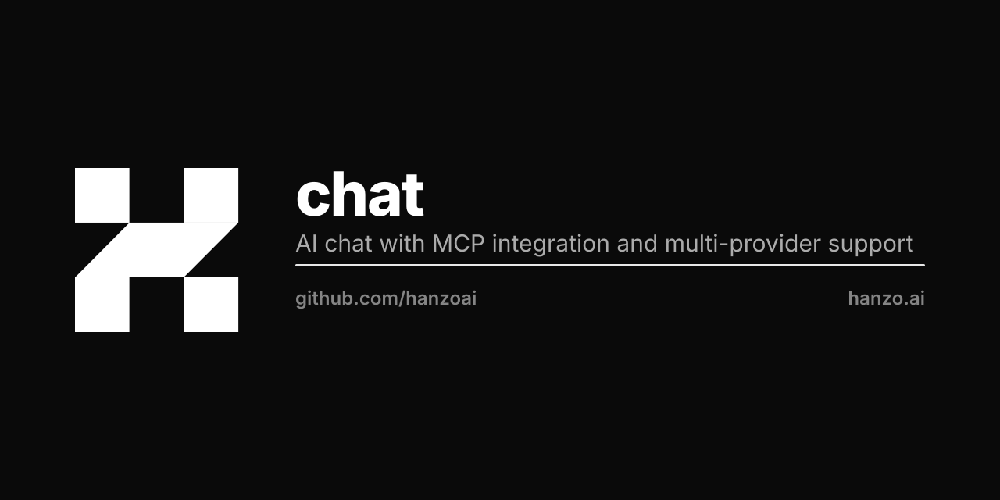

<p align="center"></p>

# Hanzo Chat

The chat surface of the Hanzo AI cloud: multi-model chat with agents, tools, and retrieval, running on Hanzo's backend. Live at [hanzo.chat](https://hanzo.chat).

Hanzo Chat is a sibling to [hanzo.app](https://hanzo.app) (the app builder) and the Hanzo console (admin). All inference, code execution, and web search route through the unified Hanzo API at `api.hanzo.ai/v1`, and sign-in is federated to Hanzo IAM ([hanzo.id](https://hanzo.id)).

## Features

- **Multi-model chat** — the Zen model family and other frontier models, served through `api.hanzo.ai`.
- **Agents** — build agents in the thread, or run your Hanzo Cloud agents (`/v1/agents`) with an `/agent` command or `@mention`.
- **MCP tools** — connect Model Context Protocol servers for tool use.
- **RAG** — chat over your own files and documents.
- **Web search** — grounded answers via Hanzo web search.
- **Code interpreter** — run code in a sandboxed runtime.
- **Image generation** — generate images inline.
- **Guest chat** — try a free Zen model with no account (optional, off by default).

## Requirements

- Node.js 24 (see `.nvmrc`)
- pnpm 10
- A Hanzo API key — get one at [hanzo.ai/dashboard](https://hanzo.ai/dashboard)

## Quick start (Docker)

```bash
git clone https://github.com/hanzoai/chat.git
cd chat
cp .env.example .env        # set HANZO_API_KEY
make up
```

Open http://localhost:3080. `make up` starts the full stack (app, MongoDB, Meilisearch) from `compose.yml`; `make down` stops it.

## Development

```bash
pnpm install               # install workspace dependencies
pnpm build:packages        # build the shared workspace packages
pnpm backend:dev           # API server on :3080 (nodemon)
pnpm frontend:dev          # Vite client dev server (second terminal)
```

Tests and checks:

```bash
pnpm test:all              # all workspace tests
pnpm e2e                   # Playwright end-to-end tests
pnpm lint                  # ESLint
pnpm format                # Prettier
```

## Configuration

Secrets live in `.env`; the model catalog and endpoints live in `chat.yaml` (copy `chat.example.yaml`). Key variables:

```env
HANZO_API_KEY=             # Hanzo API key — inference, tools, search
MONGO_URI=                 # MongoDB connection — chat history, users
JWT_SECRET=                # session token signing
CREDS_KEY=                 # credential encryption
CREDS_IV=
```

Sign-in is federated to Hanzo IAM over OpenID Connect (`OPENID_ISSUER=https://hanzo.id`, client `hanzo-chat`).

## Workspace

```
api/           Express backend (:3080) — routes, controllers, Mongoose models
client/        React frontend (Vite)
packages/      data-provider · data-schemas · api · client · agents · mcp
```

## Documentation

- Docs: https://hanzo.ai/docs/chat
- Deployment, IAM, and platform notes: [`docs/`](./docs)
- Issues: https://github.com/hanzoai/chat/issues

## License

MIT — see [LICENSE](./LICENSE) and [NOTICE](./NOTICE).
